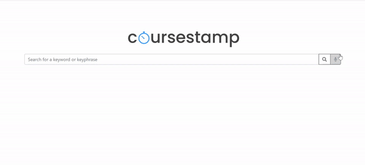

# coursestamp
> time to learn

## Motivation
When reviewing course material, students often want to revisit problem areas, gain a broad overview of a topic, or recall the exact phrases their professors have said. However, digging through hours of lecture videos is unwieldy. `coursestamp` solves this problem by presenting the exact times at which topics are mentioned in a compact fashion.

## Features
- Keyword or keyphrase search through all lecture transcripts in a chosen course
- Wide selection of courses supported, with many more on the way
- Cloud-enabled application, so can be used anywhere, anytime
- Audio input support, for ease of queries
- Embedded YouTube video support, with a functional, beautiful UI
    - Context-based phrase outputs with lecture titles
        - With emphasized keywords and keyphrases
    - Ability to click on each excerpt to skip to the correct timestamp in the embedded YouTube video

### Google Cloud
The app is deployed on Google Cloud through a custom domain: `http://coursestamp.com/`. It is relatively lightweight and is able to be quickly updated with more lecture offerings. We used Dockerfiles to manage dependencies.
### Houndify
The app uses Houndify's speech to text recognition engine to interpret speech recorded via `pyaudio`'s speech recognizer. This feature allows for efficient voice queries for users with disabilities and for greater convenience.
### Technologies Used
Flask, jQuery, CSS, HTML, Python, Docker, Google Cloud, Houndify API, youtube-dl
## Demo

In the following demos, we search for the phrase `machine learning` in Andrew Ng's free lectures on machine learning on the YouTube channel "Artificial Intelligence - All in One".

By voice query:

By text search:

## Data Processing
The core of the app relies on multiple layers of retrieving and processing input data. Much of this work can be done in advance, resulting in the storage of lightweight JSON files that can represent infromation for an entire course. It utilizes multiple utilities such as `regex` and `youtube-dl` to pattern match and collect relevant data.
- `examples/` contains a few courses available for use. In addition to the JSON file for lookup, it also contains the `raw_subtitles` initially retrieved from YouTube
- `scripts/` are some of the scripts used to retrieve subtitle information from courses
    - `playlist_to_json.py` utilizes both `playlist_to_subtitles.py` and `subtitle_parser.y` to build an internal directory structure in `examples/` for more lecture content. It is recommended to run this script in the `scripts/` directory and used in favor of manually running the other two scripts in this directory.
    - `playlist_to_subtitles.py` is powered by `youtube-dl`, and only extracts auto generated subtitles from an entire playlist. It does not download any audio or video to conserve on memory and improve performance. The file format of subtitles are `.vtt` files which are easily parsable. In addition, the file titles are of the form `"Title=%(title)s_Id=%(id)s"` following `youtube-dl`'s formatting schema. It allows for ease of regex breaking in the future to display both the embedded YouTube video and the title of the video.
    - `subtitle_parser.py` loops through the directory it is in and outputs a single JSON object. For every subtitle file, it parses the subtitles line by line and computes the starting timestamp and maps it to the phrase spoken, removing any duplicated phrases/times.
- `phrase_occurrence.py` is the primary utility that interacts with the webapp and takes in a phrase and JSON object (created from `subtitle_parser.py`) and offers the lists of titles, embedded YouTube link, and relevant matching phrase for the query. It is meant to be used in `main.py` to respond to user requests.

## Future Work
Though the JSON data files for each course are relatively small, we would like to utilize cloud data stores such as Firebase as `coursestamp` continues to scale. We currently update our library of course offerings privately and we would like students to be able to submit requests for courses. Not only would this allow for `coursestamp` to grow, but it would also enable more students to accelerate their learning. Finally, working directly with universities to integrate `coursestamp` would reduce the difficulty of accessing private course lecture videos. Not all schools have OpenCourseWare, due to limitations in budget or legal issues. Receiving permission to bypass the privacy filter would greatly help university students.
